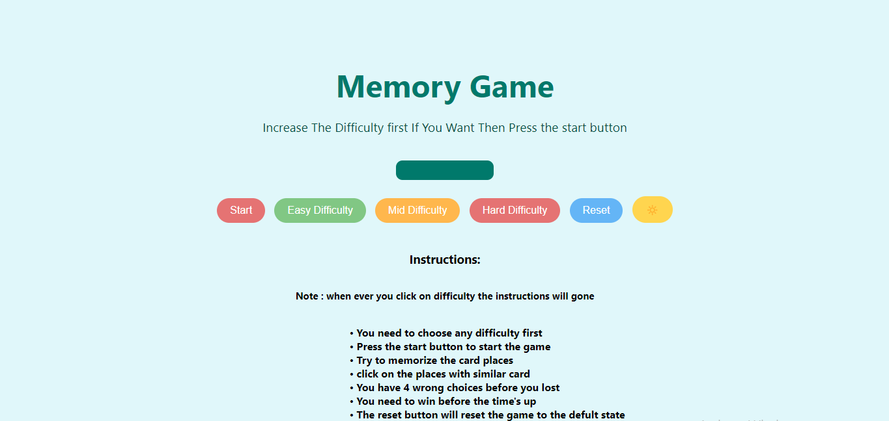

# Memory Card Game

## 10/7/2024

## Done by: Ali Abdulkarim Ebrahim

[The Game](https://ali-alaalem.github.io/Memory-card-game/) | [My Planning File](https://github.com/Ali-Alaalem/Memory-card-game/blob/main/plan.md)

## Description

It’s a memorization game. In order to win, the player must match every card in the game with its matching pair within the given time and without exceeding the max number of mistakes after seeing the images shuffle at the beginning. I chose this game because I believe it was simple for me to develop

## Technologies used:

- HTMl used to build the structure of the game
- Java Script used to give the fanctionality to the game button,img etc....
- Css used to give a design to the game

## Game Instruction

The player must first select an appropriate difficulty level, such as easy, medium, or hard. In order to watch the pictures for around three seconds before they flip back, the player should then press the start button. It is important for the player to remember where the images were after they were flipped back so he can match each card in the game with an identical card. Whenever the player makes four incorrect selections or the timer runs out, they will lose.

### Screenshot from the game

### Examble of the easy difficulty

### Examble of starting the game pressing start button

### Examble of losing with 4 wrong choice

### Examble of losing when time's up

### Examble of pressing reset button

### Future Updates

- 
- 
- 
- [x](Media query for phone)
- [x](Dark mode button)

### Credits

- images from Google
- Audios: [my instants website](https://www.myinstants.com/en/index/bh/)
